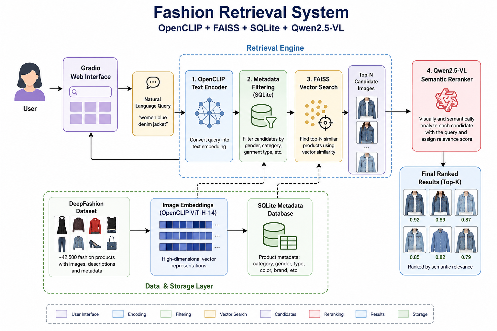
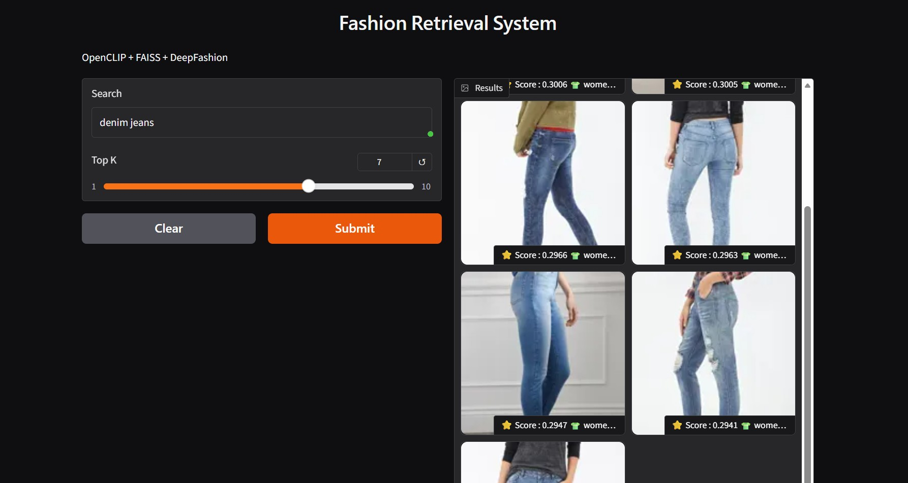
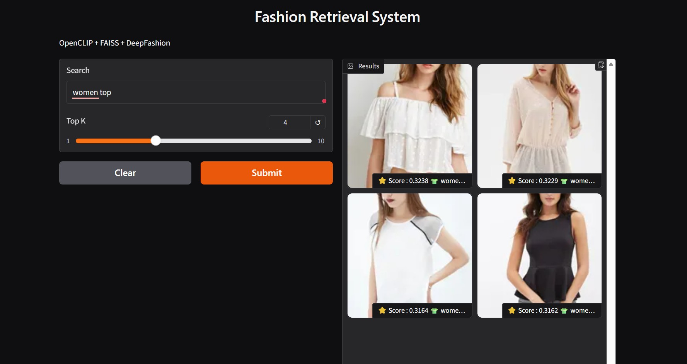
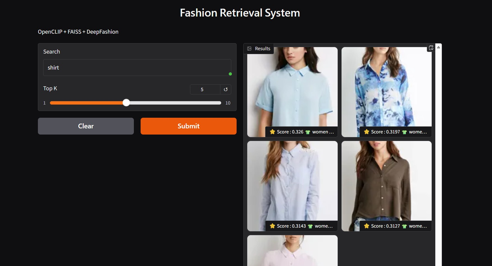

# 👗 Fashion Retrieval System using OpenCLIP, FAISS & Qwen2.5-VL


---

## Overview

This project implements a **multimodal fashion retrieval system** that retrieves visually relevant fashion products from natural language queries.

The system combines:

- OpenCLIP for multimodal embeddings
- FAISS for efficient similarity search
- SQLite for metadata filtering
- Qwen2.5-VL for semantic reranking
- Gradio for an interactive user interface

The retrieval pipeline follows a scalable two-stage retrieval architecture commonly used in production search systems.

---

# Tech Stack

| Category | Technology |
|-----------|------------|
| Programming Language | Python 3.11 |
| Vision Encoder | OpenCLIP ViT-H-14 |
| Vision Language Model | Qwen2.5-VL-7B-Instruct |
| Vector Search | FAISS |
| Metadata Database | SQLite |
| Dataset | DeepFashion Multimodal |
| Framework | PyTorch |
| UI | Gradio |
| Numerical Computing | NumPy |
| Dataset Library | Hugging Face Datasets |

---

# System Architecture

<p align="center">
  
</p>

---

# Features

- Natural language fashion search
- Hybrid retrieval pipeline
- OpenCLIP multimodal embeddings
- SQLite metadata filtering
- FAISS similarity search
- Qwen2.5-VL semantic reranking
- Interactive Gradio interface

---

# Project Structure

```text
project/
│
├── database/
├── demo/
├── indexer/
├── models/
├── retriever/
├── scripts/
├── screenshots/
├── requirements.txt
└── README.md
```

---

# Dataset

**DeepFashion Multimodal Dataset**

Approximately **42,500** fashion products containing:

- Product Images
- Product Descriptions
- Category Hierarchy
- Metadata

---

# Retrieval Pipeline

### Stage 1 — Metadata Filtering

SQLite filters candidate products using metadata such as:

- Gender
- Garment category
- Clothing type

---

### Stage 2 — Vector Retrieval

OpenCLIP converts the user query into a text embedding.

FAISS retrieves the most visually relevant fashion products.

---

### Stage 3 — Semantic Reranking

Qwen2.5-VL analyzes each retrieved image together with the user query.

Each candidate receives a semantic relevance score before producing the final ranked results.

---

# 📸 Demo

## Query: Shirt



---

## Query: Women Top



---

## Query: Denim Jeans



---

# Running the Project

### Clone Repository

```bash
git clone https://github.com/Hacxmr/ubiquitous-palm-tree.git
cd ubiquitous-palm-tree
```

### Create Environment

```bash
python -m venv .venv
source .venv/bin/activate
```

### Install Dependencies

```bash
pip install -r requirements.txt
```

### Launch

```bash
python -m demo.app
```

---

# Performance

| Metric | Value |
|---------|-------|
| Dataset Size | 42,537 Products |
| Embedding Model | OpenCLIP ViT-H-14 |
| Search Engine | FAISS |
| Metadata Store | SQLite |
| Semantic Model | Qwen2.5-VL-7B |

---

# Limitations

- Qwen reranking increases inference latency.
- Metadata filtering is currently rule-based.
- Semantic reranking is performed sequentially.

---

# Future Improvements

- Batch Qwen inference
- LLM-generated structured metadata filters
- Color-aware retrieval
- Material-aware retrieval
- FastAPI deployment
- Docker support
- TensorRT optimization
- vLLM serving
- User relevance feedback

---

# License

This project was developed for learning and research purposes.

---

# 👩‍💻 Author

**Mitali Raj**
